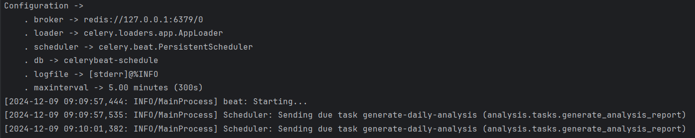
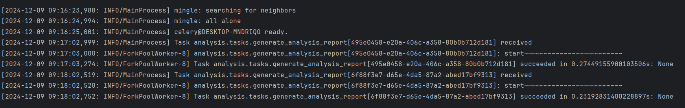

## flow chart

 
회원가입: SMTP방식을 사용하여 장고의 이메일 인증 토큰을 사용하여 자신의 계정이맞는지 확인
 
로그인: ID,PW 검증후 JWT 액세스 토큰,리프레시 토큰 발급
 
로그아웃: JWT "리프레시 토큰" Django Blacklist App에 등록
 
## celery
### beat 터미널

### worker 터미널

